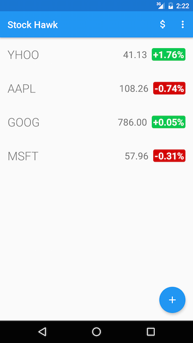
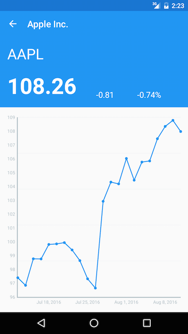
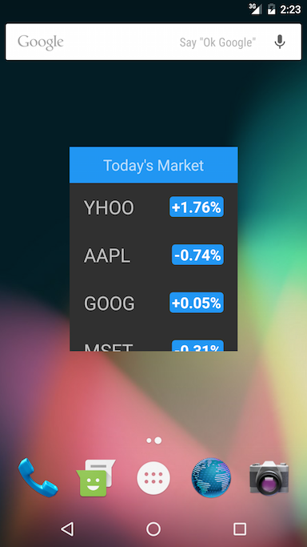

# Stock Hawk!

### Project Overview

You will productionize an app, taking it from a functional state to a production-ready state. This will involve finding and handling error cases, adding accessibility features, allowing for localization, adding a widget, and adding a library.

### What Will I Learn?

In this project, I will:

 - Diagnose existing issues with an app.
 - Make an app accessible to sight-impaired users.
 - Allow your app to be localized for distribution in other countries.
 - Handle error cases in Android.
 - Add a widget to your app experience.
 - Leverage the functionality of a library in your app.

#### TODO:
 ~~- Screen Reader > all buttons~~
 ~~- Egypt release > rtl~~
 ~~- Detail > price over time~~
 ~~- Widget~~
 ~~- Bugfixes > notfound, connection, blank screen~~

### Screenshots

